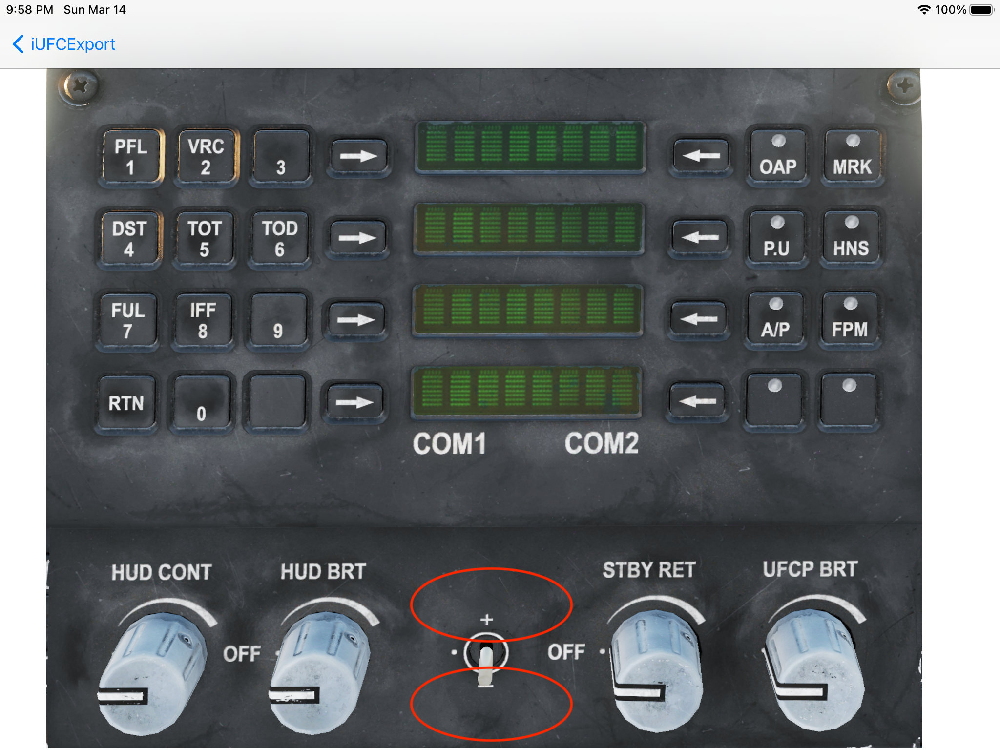

# iUFCExport
Display and interact with DCS ([Digital Combat Simulator](https://www.digitalcombatsimulator.com)) plane panels from your iPad

Check [this video](https://www.youtube.com/watch?v=Kx_l9_WEQhs) of iUFCExport in action.

## How to install and configure

1) Install the iPad application from the Apple AppStore or use Xcode to build the application from [source](https://github.com/wluc9875/iUFCExport-iPad)

2) Install the Lua script on the PC where you installed DCS. Follow these [instructions](https://github.com/wluc9875/iUFCExport-LuaScript#readme).

3) (Optional) If after installing everything as explained in steps 1 and 2, you can't control DCS from your iPad, you may have to configure a different outbound IP address. Follow these [instructions](https://github.com/wluc9875/iUFCExport-iPad#configuration).

## Current version
1.0

## Supported planes and panels
### F-16C ICP

All buttons, switches and rotating wheels can be used.

To use a switch, touch in the area towards which you want to push this switch.

To use a rotating wheel, touch its upper area or its lower area to rotate in the corresponding direction.

### F/A-18C UFC

All buttons, switches and rotating buttons can be used.

To use a switch, touch in the area towards which you want to push this switch.

For rotating buttons, touch in its left or right half to respectively turn it counterclockwise or clockwise.

The COMM channel buttons work like this:
* touch the COMM channel display to push it
* touch below or above the COMM channel display to respectively decrease or increase the channel

### AV-8BNA UFC and ODUs

All buttons and rotating buttons can be used, except:
* the 2 volume buttons
* the brightness button

The COMM channel buttons work like this:
* touch the button to push it
* touch below or above the COMM button to respectively decrease or increase the channel

### JF-17 UFCP

All buttons can be used

## Source code
* [Lua script source code](https://github.com/wluc9875/iUFCExport-LuaScript)
* [iPad source code](https://github.com/wluc9875/iUFCExport-iPad)

## [Privacy policy](privacy.md)
